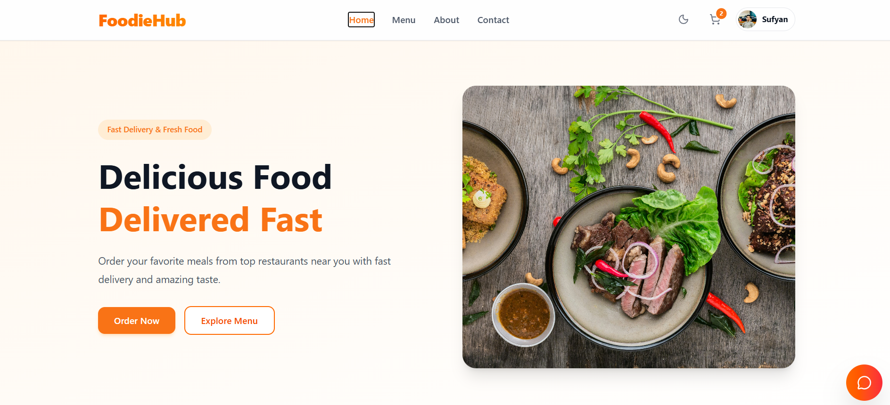
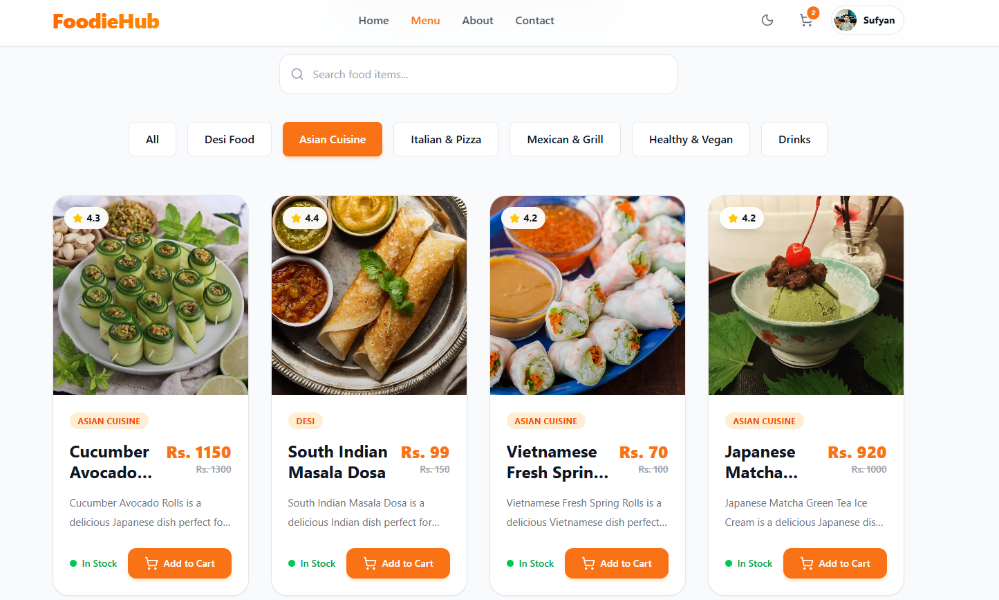
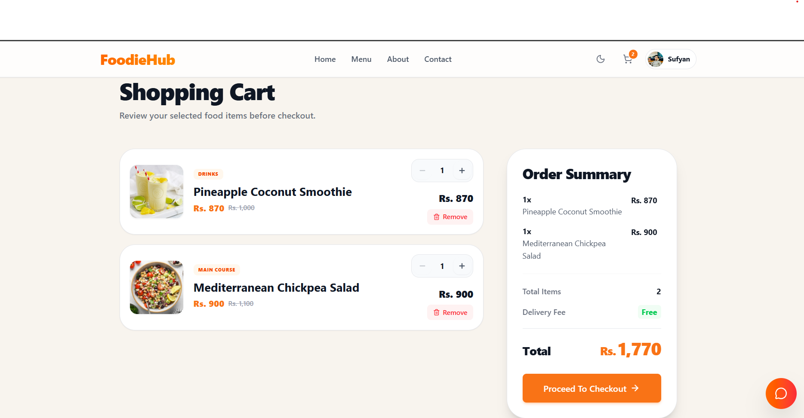
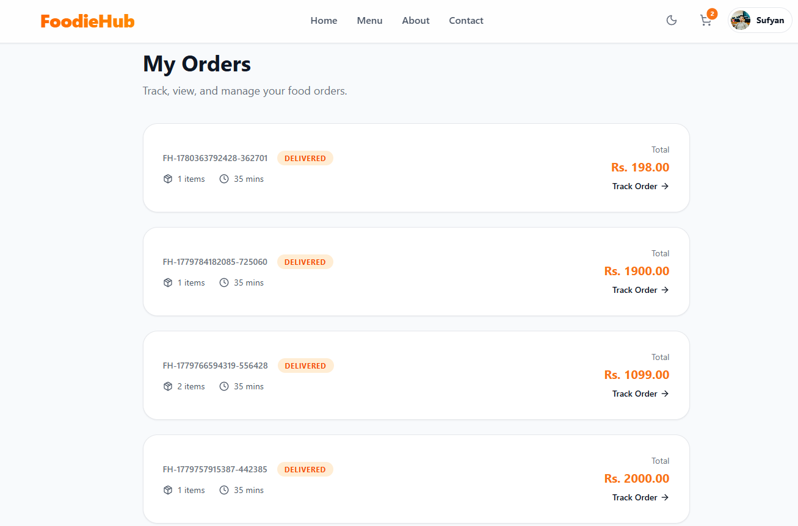
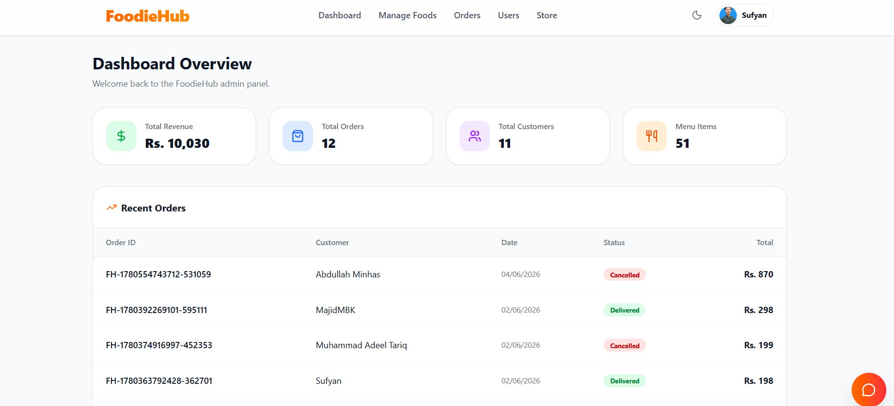

# 🍽️ Restaurant Ordering & Management System


A full-stack restaurant management and ordering platform built with **React.js, Tailwind CSS, Node.js, Express.js, and MySQL**.

This application provides customer and admin dashboards with features like food management, order processing, secure authentication, AI-powered chatbot assistance, online payments, email services, and cloud-based integrations.

---

# 🚀 Features

## 👤 Customer Features

- User registration and login
- Browse food items and categories
- Add products to cart
- Place orders
- Track order status
- Online payment integration
- AI chatbot assistance

---

## 🛠️ Admin Dashboard

- Manage food items
- Manage categories
- Manage customer orders
- Update order status
- Manage restaurant operations

---

# 🤖 AI Chatbot Integration

- Integrated LLM-powered chatbot
- Uses Grok API for AI-based customer assistance
- Provides restaurant-related query support

---

# 🔐 Authentication & Security

- JWT-based authentication
- Role-based access control
- Password hashing using bcrypt
- Protected API routes

---

# 📧 Email Services

- Automated email notifications
- SMTP integration
- Brevo integration for reliable email delivery

---

# 🖼️ Image Management

- Image upload handling using Multer
- Cloud image storage using Cloudinary

---

# 💳 Payment Integration

- Stripe payment gateway integration
- Implemented test payment workflow

---

# 🏗️ Tech Stack

## Frontend

- React.js
- Tailwind CSS
- Axios

## Backend

- Node.js
- Express.js
- REST APIs

## Database

- MySQL

## Authentication

- JWT
- bcrypt

## External Services

- Grok LLM API
- Stripe
- Cloudinary
- Brevo
- SMTP

## Deployment

- Frontend: Vercel
- Backend: Railway
- Database: Railway MySQL

---

# 📂 Project Architecture

```
                                User
                  |
                  |
          React.js + Tailwind CSS
                  |
                  |
            Axios REST API
                  |
                  |
         Node.js + Express.js
                  |
    --------------------------------
    |              |               |
 MySQL          JWT/Auth        External APIs
                                |
                --------------------------------
                |        |        |        |
              Grok    Stripe  Cloudinary Brevo
               AI     Payment   Images   Emails
```

---

# ⚙️ Installation & Setup

## Clone Repository

```bash
git clone https://github.com/sufyan-aslam-code/Restaurant-Ordering-Management-System.git
```

---

## Frontend Setup

```bash
cd frontend

npm install

npm run dev
```

---

## Backend Setup

```bash
cd backend

npm install

npm start
```

---

## Environment Variables

Create `.env` files for frontend and backend.

Required configurations:

- Database credentials
- JWT secret
- Stripe keys
- Cloudinary credentials
- Grok API key
- Email service credentials

---

# 📌 API Modules

Backend APIs include:

- Authentication APIs
- User management
- Food/product management
- Category management
- Order management
- Payment processing
- Image upload handling
- AI chatbot requests

---

# 🌟 Project Highlights

- Full-stack application architecture
- AI chatbot integration
- Secure authentication system
- Admin management dashboard
- Payment gateway integration
- Cloud-based image management
- Production deployment experience

---

# 🔮 Future Improvements

- Real-time order tracking
- AI-based food recommendations
- Advanced restaurant analytics
- Mobile application

---

# 👨‍💻 Developer

**Sufyan Aslam**

BS Computer Science Student  
Full Stack Developer

GitHub: [sufyan-aslam-code](https://github.com/sufyan-aslam-code)

LinkedIn: [Sufyan Aslam](https://linkedin.com/in/sufyan-aslam-code)


---

# 📸 Application Screenshots

## 🏠 Home Page




## 🍽️ Menu Page




## 🛒 Shopping Cart & Checkout




## 📦 Order Management




## 🛠️ Admin Dashboard



---
